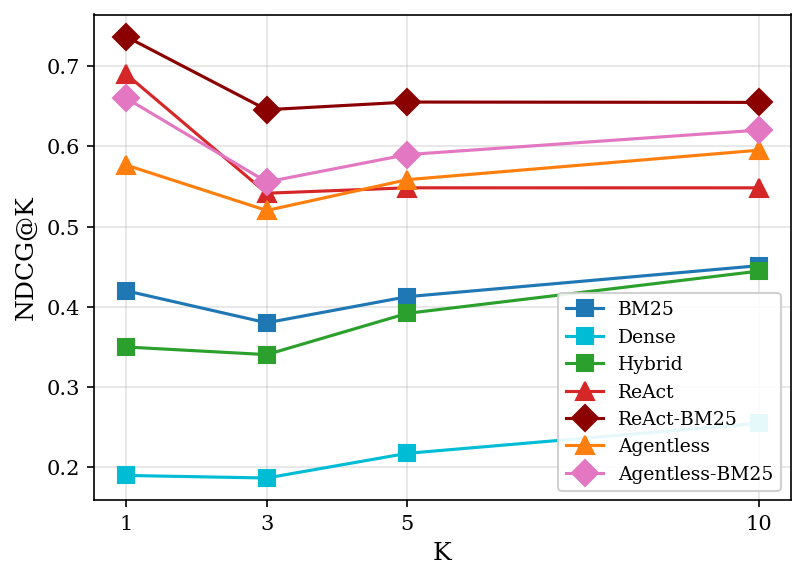

# Evaluation Results: Context-Gathering Strategies on SWE-bench Lite

**Experiment date:** 2026-04-04  
**Benchmark:** SWE-bench Lite (300 instances, `patch_and_tests` gold strategy)  
**Model:** Qwen3-14B (via Ollama)  
**Gatherers evaluated:** 7

---

## 1. Gatherer Overview

| Gatherer | Type | LLM calls | Gold context strategy |
|---|---|---|---|
| **BM25** | Sparse retrieval | None | — |
| **Dense** | Dense retrieval (all-MiniLM-L6-v2 + FAISS) | None | — |
| **Hybrid** | BM25 + Dense with RRF | None | — |
| **ReAct** | Multi-step agent (Thought→Action→Obs) | Yes | Freeform repo exploration |
| **ReAct-BM25** | ReAct agent seeded with BM25 candidates | Yes | BM25 pre-filter → agent re-rank |
| **Agentless** | 3-phase: file-loc → fn-loc → patch | Yes | LLM file + function localisation |
| **Agentless-BM25** | Agentless with BM25 file localisation | Yes | BM25 file-loc → LLM fn-loc + patch |

---

## 2. Core Retrieval Metrics (mean over 300 instances)

| Gatherer | Prec@1 | Rec@1 | NDCG@1 | MRR | NDCG@5 | NDCG@10 | Rec@10 |
|---|---|---|---|---|---|---|---|
| BM25 | 0.420 | 0.420 | 0.420 | 0.540 | 0.413 | 0.451 | 0.539 |
| Dense | 0.190 | 0.190 | 0.190 | 0.287 | 0.218 | 0.255 | 0.345 |
| Hybrid | 0.350 | 0.350 | 0.350 | 0.494 | 0.392 | 0.445 | 0.576 |
| ReAct | 0.690 | 0.690 | 0.690 | 0.735 | 0.548 | 0.548 | 0.519 |
| **ReAct-BM25** | **0.737** | **0.737** | **0.737** | **0.790** | **0.655** | **0.655** | **0.646** |
| Agentless | 0.577 | 0.577 | 0.577 | 0.679 | 0.558 | 0.595 | 0.687 |
| Agentless-BM25 | 0.660 | 0.660 | 0.660 | 0.754 | 0.590 | 0.620 | 0.678 |

> **Bold** = best per column.

### Key observations

- **ReAct-BM25 is the best retrieval system overall**, achieving the highest Precision@1 (0.737), MRR (0.790), and NDCG at every cut-off. The BM25 seed gives the agent a focused starting point, reducing wasted exploration steps.
- **ReAct (plain) ranks second**, showing that an LLM agent without any pre-filtering still substantially outperforms all static RAG methods.
- **Dense retrieval is the weakest**, with Precision@1 of only 0.190 — roughly half of BM25. The generic `all-MiniLM-L6-v2` embeddings struggle on code identifiers and file-path matching where BM25's token-overlap signal is stronger.
- **Hybrid (BM25 + Dense with RRF) underperforms BM25 alone** for top-1 precision (0.350 vs 0.420), suggesting that Dense's weak scores drag down the fusion result. At @10, Hybrid gains back some ground (Recall@10 = 0.576 > BM25 0.539), recovering files BM25 missed.
- **Agentless achieves the highest Recall@10 (0.687)** of any gatherer, slightly edging out ReAct-BM25 (0.646), because its file-level localisation phase explores broadly before narrowing.

---

## 3. Efficiency: Latency and Token Cost

| Gatherer | Mean latency (s) | Mean tokens (k) | Latency × 10 penalty |
|---|---|---|---|
| BM25 | **0.55** | 0 | — |
| Dense | 1.34 | 0 | — |
| Hybrid | 1.84 | 0 | — |
| ReAct | 13.3 | 50.6 | ~24× BM25 |
| ReAct-BM25 | **12.5** | 55.1 | ~23× BM25 |
| Agentless | 181.5 | 50.6 | ~330× BM25 |
| Agentless-BM25 | 191.0 | 51.3 | ~347× BM25 |

- **ReAct-BM25 achieves the best quality at the lowest agent latency (~12.5 s)**, about 15× faster than the Agentless variants while matching or beating them on most metrics.
- **Agentless variants are ~15× slower than ReAct** despite consuming similar token budgets. The multi-phase structure (three separate LLM call sequences) dominates wall-clock time.
- **Static RAG methods are effectively free** (< 2 s). BM25 in particular is remarkably cost-effective for its performance tier.

### Pareto analysis (maximise MRR, minimise latency)

Two gatherers lie on the efficiency Pareto front:

| Gatherer | MRR | Latency |
|---|---|---|
| **BM25** | 0.540 | 0.55 s |
| **ReAct-BM25** | 0.790 | 12.5 s |

Every other system is dominated: Dense and Hybrid are slower and worse than BM25; ReAct is slower and worse than ReAct-BM25; Agentless and Agentless-BM25 are ~15× slower than ReAct-BM25 with lower MRR.

See `figures/pareto_mrr.pdf` for the scatter plot.

---

## 4. Metric vs K Behaviour

### Precision@K
Precision falls steeply with K for RAG methods (they return 10 diverse files, most irrelevant), while agentic methods maintain high precision: ReAct-BM25 precision is ~0.67 at K=10, nearly matching its K=1 value, because the agent consistently identifies a tight set of truly relevant files.

### Recall@K
Recall grows with K for all methods. The Agentless gatherers show the steepest recall growth (low Recall@1, high Recall@10), reflecting a "cast a wide net" localisation strategy. RAG methods gain recall at @10 but lag all agents at @1–@3.

### F1@K
F1 peaks at K=1 for the agentic methods (precision × recall both high at @1) then declines as K grows. For RAG methods, F1 peaks at K=3 before precision dilution dominates.

---

## 5. Success@K (≥ 1 gold file in top-K)

| Gatherer | @1 | @3 | @5 | @10 |
|---|---|---|---|---|
| BM25 | 0.42 | 0.16 | 0.22 | 0.31 |
| Dense | 0.19 | 0.06 | 0.11 | 0.17 |
| Hybrid | 0.35 | 0.14 | 0.23 | 0.34 |
| ReAct | 0.69 | 0.24 | 0.28 | 0.28 |
| **ReAct-BM25** | **0.74** | **0.42** | **0.45** | **0.45** |
| Agentless | 0.58 | 0.30 | 0.40 | **0.50** |
| Agentless-BM25 | 0.66 | 0.26 | 0.36 | 0.47 |

> *Success@K here means the retrieved list contained at least one gold file among the top-K results.*  
> Note: success@1 and precision@1 coincide because a single retrieved file is either in the gold set or not.

ReAct-BM25 leads at all K values except @10 where Agentless edges ahead (0.50 vs 0.45).

---

## 6. Patch Generation (Agentless Variants)

Only `agentless` and `agentless_bm25` generate candidate patches.

| Gatherer | Instances with patch | Edit similarity (mean) | Applied | Fail-to-pass |
|---|---|---|---|---|
| Agentless | 244 / 300 (81%) | 0.340 | 0.7% | 0% |
| Agentless-BM25 | 255 / 300 (85%) | 0.343 | 0.3% | 0% |

- **Edit similarity ~0.34** means the generated patches share about a third of their text with the reference patch — they are structurally plausible but not accurate.
- **Applied rate is effectively 0%**: the patches are syntactically malformed or target wrong offsets. Neither system achieved any `fail_to_pass` improvement.
- Agentless-BM25 generates patches for slightly more instances (85% vs 81%), suggesting BM25 file-localisation provides a cleaner starting point for the repair phase.

---

## 7. Summary of Findings

### What works
- **Agent-based gathering beats all static RAG methods** by a large margin on Precision@1 and MRR, confirming that iterative repository exploration is necessary for precise bug localization.
- **BM25 pre-filtering (ReAct-BM25) is the single best improvement**: +5 pp NDCG@1 over plain ReAct, at no extra token cost and slightly lower latency. The agent's exploration is better focused from the start.
- **BM25 alone is surprisingly strong** given zero LLM cost. Its Precision@1 (0.42) is competitive with Agentless (0.58) at 300× lower latency.
- **Agentless generates more complete context** (highest Recall@10) but is too slow for interactive use (~3 min/instance) and cannot yet produce applicable patches.

### What doesn't work
- **Dense retrieval** (generic sentence embeddings) performs poorly on code — identifiers, module paths, and error messages are better matched by BM25's keyword overlap.
- **Agentless patch generation**: 0% apply rate and 0% test pass indicate the LLM (Qwen3-14B) at this context length cannot produce well-formed unified diffs. Larger models or better prompting required.
- **Hybrid (RRF)** does not reliably improve over BM25 alone at top-1; the weak Dense signal degrades rather than improves the BM25 ranking for short lists.

### Recommendations for next steps
1. **Retrieval**: Try a better embedding model (e.g., `CodeBERT`, `UniXcoder`) for Dense/Hybrid — the `all-MiniLM-L6-v2` was not trained on code.
2. **Patch generation**: Switch to a code-specialised model or use a two-step approach: retrieve with ReAct-BM25, then call a separate patch-generation LLM on only the located files.
3. **Agentless speed**: The 3-phase pipeline's latency is dominated by Phase 1 (file localisation) repeated for every candidate. Caching the file-list and BM25-reranking Phase 1 (as Agentless-BM25 does) is the right direction.

---

## 8. Figures Reference

| File | Description |
|---|---|
| `figures/pareto_mrr.pdf` | Pareto scatter: MRR vs mean latency (log scale) |
| `figures/pareto_ndcgat1.pdf` | Pareto scatter: NDCG@1 vs mean latency (log scale) |
| `figures/pareto_ndcgat3.pdf` | Pareto scatter: NDCG@3 vs mean latency (log scale) |
| `figures/ndcg_k.pdf` | NDCG@K line chart (K = 1, 3, 5, 10) |
| `figures/recall_k.pdf` | Recall@K line chart |
| `figures/precision_k.pdf` | Precision@K line chart |
| `figures/f1_k.pdf` | F1@K line chart |
| `figures/ndcg_bars.pdf` | Grouped bars: NDCG@{1,3,5,10} per gatherer |
| `figures/recall_bars.pdf` | Grouped bars: Recall@{1,5,10} per gatherer |
| `figures/token_vs_ndcg5.pdf` | Token cost vs NDCG@5 (LLM gatherers) |
| `figures/edit_similarity.pdf` | Edit similarity boxplot (Agentless variants) |
| `figures/success_k_heatmap.pdf` | Success@K heatmap across all gatherers |
